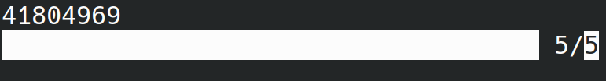

<a name="readme-top"></a>
# totp
Time-based one-time password implementation

<!-- TABLE OF CONTENTS -->
<details>
  <summary>Table of Contents</summary>
  <ol>
    <li>
      <a href="#about">About</a>
    </li>
    <li>
        <a href="#how-to-use">How to use</a>
    </li>
    <li>
        <a href="#license">License</a>
    </li>
  </ol>
</details>

## About

This is a rust implementation of the <a href="https://datatracker.ietf.org/doc/html/rfc6238">TOTP algorithm</a> for education/learning process.

<p align="right">(<a href="#readme-top">back to top</a>)</p>


## How to use


There are 4 parameters:
<ul>
    <li>
        key ( = very_secret_key ) : used as key/seed for the algorithm
    </li>
    <li>
        T0 ( = 0 seconds ) : the inital steps from epoch unix stampstand
    </li>
    <li>
        X ( = 5 seconds ) : the time to live (TTL) of the password
    </li>
    <li>
        digits ( = 8 ) : the length of the password generated
    </li>
</ul>

To run the program use
```
cargo run
```

You'll receive in the terminal, the password generated based on your timestamp, with a progressbar under it showcasing the TTL.

Once the bar fills up, it will restarts with a new generated password.



<p align="right">(<a href="#readme-top">back to top</a>)</p>

## License

Distributed under the BSD 2-Clause License. See `LICENSE.txt` for more information.

<p align="right">(<a href="#readme-top">back to top</a>)</p>
